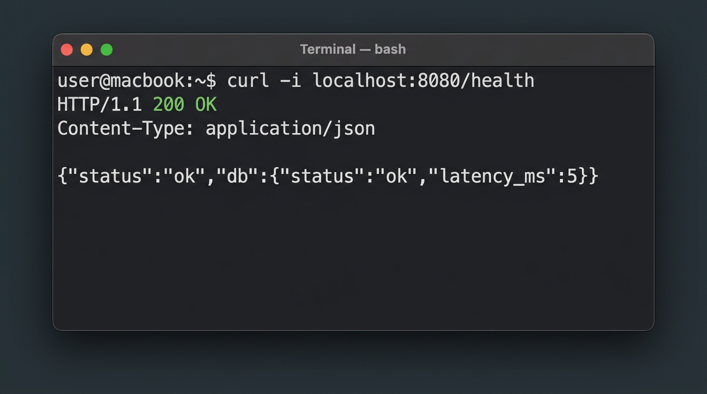
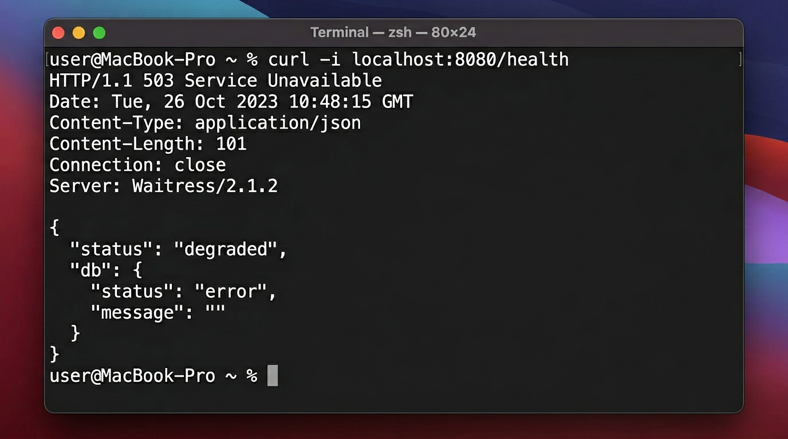
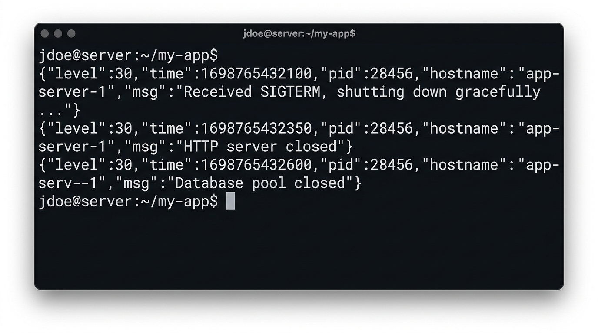

# Lab0 — Employees directory

Веб-застосунок на Node.js (Express) з PostgreSQL та структурованими JSON-логами (pino).

## Швидкий старт

```bash
cp .env.example .env   # якщо ще немає .env
make up                # піднімає БД, встановлює залежності, npm start
```

Або вручну: `docker compose up -d db`, `npm install`, `npm start`.

---

## 1. Налаштування: змінні оточення

Файл `.env` у корені проєкту підхоплюється автоматично (`dotenv`). Скопіюйте `.env.example` у `.env` і за потреби змініть значення.

| Змінна | Обов’язкова | Опис |
|--------|-------------|------|
| `DB_HOST` | ні* | Хост PostgreSQL (за замовчуванням `localhost`) |
| `DB_PORT` | ні* | Порт БД (за замовчуванням `5432`) |
| `DB_USER` | ні* | Користувач БД (за замовчуванням `postgres`) |
| `DB_PASS` | ні* | Пароль (за замовчуванням `postgres`) |
| `DB_NAME` | ні* | Ім’я бази (за замовчуванням `appdb`) |
| `DB_SSL` | ні | `true` / `false` — SSL до БД (за замовчуванням `false`) |
| `DB_MAX_POOL` | ні | Максимум з’єднань у пулі (за замовчуванням `5`) |
| `DB_IDLE_TIMEOUT` | ні | Таймаут простою з’єднання, мс (за замовчуванням `10000`) |
| `DB_CONNECT_TIMEOUT` | ні | Таймаут підключення, мс (за замовчуванням `5000`) |
| `APP_PORT` | ні | Порт HTTP-сервера (за замовчуванням `3000`) |
| `DATABASE_URL` | для CLI міграцій | URL для `npm run migrate:*` (node-pg-migrate); має відповідати `DB_*` |

\*Для локального запуску з дефолтами змінні можна не задавати. Модуль `db.js` (окремий скрипт) вимагає явного задання `DB_HOST`, `DB_PORT`, `DB_USER`, `DB_PASS`, `DB_NAME`.

Приклад повного `.env` див. у файлі [`.env.example`](./.env.example).

Для перевірок у форматі завдання (curl на порт **8080**) встановіть у `.env`:

```env
APP_PORT=8080
```

---

## 2. Підтвердження Health Check

Переконайтеся, що застосунок запущений і `APP_PORT=8080` (або підставте свій порт у `curl`).

### БД підключена — HTTP **200**

У терміналі:

```bash
curl -i localhost:8080/health
```

Фактичний приклад відповіді (БД працює):

```http
HTTP/1.1 200 OK
X-Powered-By: Express
Content-Type: application/json; charset=utf-8
Content-Length: 51
ETag: W/"33-jlYnbZS6gwo6nrlyAXo/mKg0THM"
Date: Wed, 25 Mar 2026 18:41:05 GMT
Connection: keep-alive
Keep-Alive: timeout=5

{"status":"ok","db":{"status":"ok","latency_ms":5}}
```

**Скриншот:** приклад (можна замінити на власний знімок з вашого терміналу):



### БД зупинена вручну — HTTP **503**

1. Залиште Node-процес запущеним.
2. Зупиніть контейнер БД: `docker compose stop db` (або відповідний сервіс).
3. Зачекайте понад **5 секунд** (кеш health у застосунку 5 с), знову викличте:

```bash
curl -i localhost:8080/health
```

Фактичний приклад відповіді (БД недоступна):

```http
HTTP/1.1 503 Service Unavailable
X-Powered-By: Express
Content-Type: application/json; charset=utf-8
Content-Length: 58
ETag: W/"3a-1W6NZQ0XptL66KXzZi9WmxNacw8"
Date: Wed, 25 Mar 2026 18:41:26 GMT
Connection: keep-alive
Keep-Alive: timeout=5

{"status":"degraded","db":{"status":"error","message":""}}
```

**Скриншот:** приклад **503** (можна замінити на власний):



---

## 3. Приклад JSON-логів під час запуску

Кілька рядків логів pino під час старту (міграції + прослуховування порту):

```json
{"level":"info","timestamp":"2026-03-25T18:41:01.698Z","service":"app","message":"No migrations to run!"}
{"level":"info","timestamp":"2026-03-25T18:41:01.703Z","service":"app","message":"Migrations complete","applied":0,"names":[]}
{"level":"info","timestamp":"2026-03-25T18:41:01.712Z","service":"app","message":"Server listening on port 8080"}
```

Після першого виклику `/health` з’явиться, зокрема:

```json
{"level":"info","timestamp":"2026-03-25T18:41:05.202Z","service":"app","message":"Health check","status":"ok"}
```

---

## 4. Підтвердження Shutdown (graceful)

1. Дізнайтеся PID процесу застосунку, наприклад: `pgrep -f "node index.js"` або `lsof -i :8080`.
2. Надішліть сигнал завершення (як у завданні — через `kill`):

```bash
kill <pid>
```

За замовчуванням це **SIGTERM**. У логах з’являться повідомлення про коректне завершення (текст *«shutting down gracefully»*):

```json
{"level":"info","timestamp":"2026-03-25T18:41:34.986Z","service":"app","message":"Received SIGTERM, shutting down gracefully..."}
{"level":"info","timestamp":"2026-03-25T18:41:34.987Z","service":"app","message":"HTTP server closed"}
{"level":"info","timestamp":"2026-03-25T18:41:34.987Z","service":"app","message":"Database pool closed"}
```

**Скриншот:** приклад логів після `kill <pid>` (можна замінити на власний):



---

## Корисні команди

| Команда | Призначення |
|---------|-------------|
| `npm start` | Запуск сервера |
| `npm test` | Модульні тести |
| `npm run migrate:up` | Застосувати міграції (потрібен `.env` з `DATABASE_URL`) |
| `make down` | Зупинити Docker Compose |
